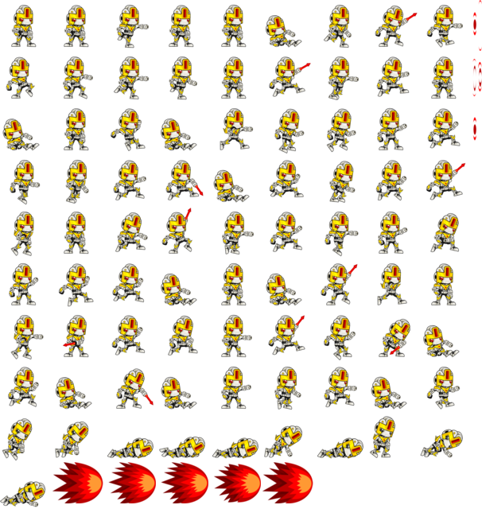
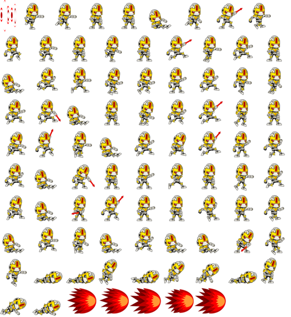
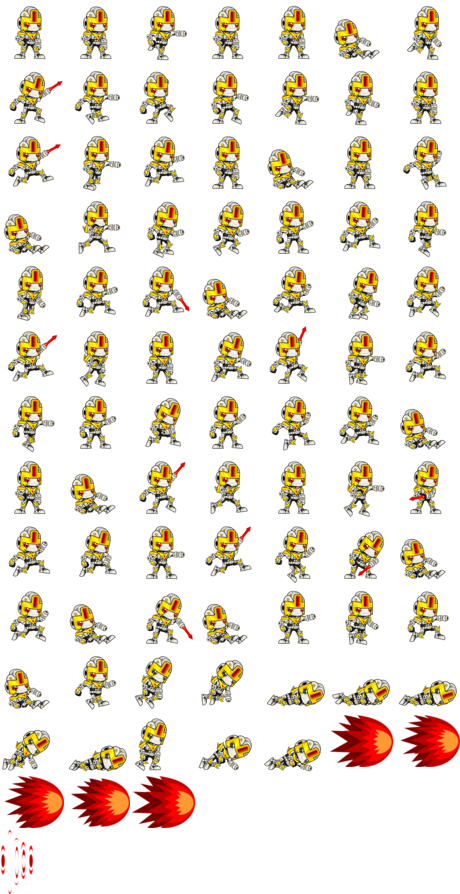
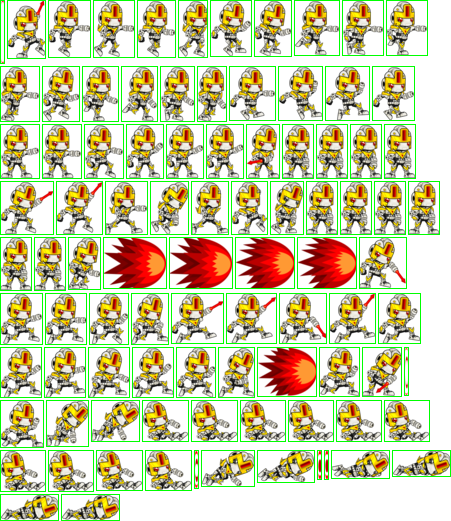
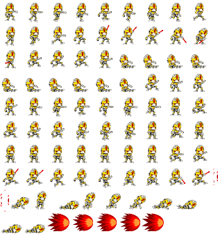

# sprat-cli

**The UNIX-way sprite sheet generator.**


`sprat-cli` is a modular toolkit for generating sprite sheets (texture atlases) from the command line. Unlike monolithic GUI tools, it splits the packing process into discrete, pipeable commands. This makes it perfect for:

*   **CI/CD Pipelines**: Automate asset generation in your build process.
*   **Shell Scripting**: Integrate naturally with `|`, `>`, and standard text tools.
*   **Game Development**: Optimized packing algorithms for GPU memory.
*   **Web & Apps**: Export to CSS, JSON, XML, or custom formats.

---

## 🚀 Quick Start

**Build and Install:**

```sh
sh build.sh
```

Generate layout first:

```sh
./spratlayout ./frames > layout.txt
```

Inspect layout text:

```sh
cat layout.txt
```

Pack PNG from that layout:

```sh
./spratpack < layout.txt > spritesheet.png
```

Optional one-pipe run:

```sh
./spratlayout ./frames --trim-transparent --padding 2 | ./spratpack > spritesheet.png
```

**New: Tar File Support**

`spratlayout` now accepts tar archives as input. This is useful for bundling sprite assets or working with compressed archives.

```sh
# Regular tar file
./spratlayout sprites.tar > layout.txt

# Compressed tar files (gzip, bzip2, xz)
./spratlayout sprites.tar.gz > layout.txt
./spratlayout sprites.tar.bz2 > layout.txt
./spratlayout sprites.tar.xz > layout.txt
```

The tool automatically extracts the archive to a temporary directory and processes all image files found within. Temporary directories are cleaned up automatically after processing.

Convert layout to JSON/CSV/XML/CSS:

```sh
./spratconvert --transform json < layout.txt > layout.json
```

Detect sprite frames in spritesheets:

```sh
./spratframes spritesheet.png > frames.spratframes
```

Extract sprites from spritesheets using frame coordinates:

```sh
./spratunpack spritesheet.png --frames frames.spratframes --output output/
```

Manual page:

```sh
man ./man/sprat-cli.1
```

## Installation

Install binaries, man page, and global profile config:

```sh
sudo cmake --install .
```

## Workflow

`sprat-cli` follows the UNIX philosophy: each tool does one thing well and communicates via text. The standard pipeline consists of three steps:

                    ┌───────────────────────────┐
                    │       IMAGE FOLDER        │
                    │        ./frames           │
                    └─────────────┬─────────────┘
                                  │
                                  ▼
                        ┌─────────────────┐
                        │   spratlayout   │
                        │   (scanning)    │
                        │  math only      │
                        └────────┬────────┘
                                 │  stdout
                                 ▼
                           layout.txt
                                 │
              ┌──────────────────┴──────────────────┐
              ▼                                     ▼
     ┌─────────────────┐                   ┌─────────────────┐
     │    spratpack    │                   │  spratconvert   │
     │    (packing)    │                   │ (transforming)  │
     │  layout → PNG   │                   │ layout → JSON   │
     └────────┬────────┘                   └────────┬────────┘
              │ stdout                              │ stdout
              ▼                                     ▼
     spritesheet.png                          layout.json

### 1. Scanning (`spratlayout`)
Scans a folder of images and calculates their optimal positions. It prints a **layout text** to stdout. This step is mathematical and does not process image pixels, making it extremely fast.
```sh
./spratlayout ./frames > layout.txt
```

### 2. Packing (`spratpack`)
Reads the layout text from stdin, loads the images, and blits them into a single PNG atlas.
```sh
./spratpack < layout.txt > spritesheet.png
```

### 3. Transforming (`spratconvert`)
Reads the layout text and transforms it into a metadata format (JSON, CSV, XML, etc.) for your game engine.
```sh
./spratconvert --transform json < layout.txt > layout.json
```

### Extra: Deconstruction (Reverse Engineering)
             ┌──────────────────────────┐
             │   existing_sheet.png     │
             └─────────────┬────────────┘
                           │
                           ▼
                    ┌──────────────┐
                    │ spratframes  │
                    │  (detect)    │
                    └───────┬──────┘
                            │ stdout
                            ▼
                        frames.txt
                            │
                            ▼
                    ┌──────────────┐
                    │ spratunpack  │
                    │  (unpack)    │
                    └───────┬──────┘
                            ▼
                    ./recovered_frames
                            │
                            ▼
                       (feeds into)
                       spratlayout
If you start with a monolithic spritesheet and need to recover individual frames or its layout before using the workflow above:
1.  **Detect (`spratframes`)**: Scans an existing spritesheet and prints a layout definition to stdout.
    ```sh
    ./spratframes existing_sheet.png > frames.txt
    ```
2.  **Unpack (`spratunpack`)**: Takes the sheet and the detected frames to extract individual images.
    ```sh
    ./spratunpack existing_sheet.png --frames frames.txt --output ./recovered_frames
    ```
Now you can use `./recovered_frames` as the input for `spratlayout`.

---

## Configuration & Profiles

### Profiles
Profiles are named rule sets that group packing options (mode, padding, scale, etc.). Instead of passing ten flags to `spratlayout`, you can define a profile in `spratprofiles.cfg` and use it with `--profile NAME`.

Profile definitions are searched in:
1. `--profiles-config PATH` (CLI override)
2. User config:
   - Linux/macOS: `~/.config/sprat/spratprofiles.cfg`
   - Windows: `%APPDATA%\sprat\spratprofiles.cfg`
3. `./spratprofiles.cfg` (current working directory)
4. `/usr/local/share/sprat/spratprofiles.cfg` (Global)

### Spratlayout Options
- `--mode compact|pot|fast`: Packing algorithm choice.
- `--optimize gpu|space`: Prioritize GPU-friendly dimensions or minimum area.
- `--padding N`: Pixels between sprites to prevent texture bleeding.
- `--trim-transparent`: Remove empty borders to save space.
- `--rotate`: Allow 90-degree rotation during packing for tighter layouts.
- `--scale F`: Pre-scale images (0.0 to 1.0).
- `--threads N`: Parallelize the packing search.

### Layout Caching
`spratlayout` automatically caches image metadata in the system temp directory. If your source images haven't changed, subsequent runs will be nearly instantaneous. Entries older than one hour are pruned automatically.

---

## Sprite Detection (`spratframes`)

### Compact Mode (GPU Optimized)

Default behavior. Tries to keep the atlas square-ish but prioritizes width/height that fits well in GPU memory.

!Compact GPU

```sh
./spratlayout ./frames --mode compact --optimize gpu --padding 2 > layout.txt
./spratpack < layout.txt > compact_gpu_pad2.png
```


### Compact Mode (Space Optimized)

Tries to minimize total area, regardless of aspect ratio.

```sh
./spratlayout ./frames --mode compact --optimize space --padding 2 > layout.txt
./spratpack < layout.txt > compact_space.png
```


### Fast Mode

Uses a shelf packing algorithm. Much faster for huge datasets, but less efficient packing.

```sh
./spratlayout ./frames --mode fast --padding 2 > layout.txt
./spratpack < layout.txt > fast.png
```


### Power of Two (POT)

Forces the output atlas to be a power of two (e.g., 512x512, 1024x512).

```sh
./spratlayout ./frames --mode pot --padding 2 > layout.txt
./spratpack < layout.txt > pot.png
```


### Trimming Transparency

Removes transparent pixels from sprite edges. `spratpack` can draw frame lines to visualize the trimmed bounds.

```sh
./spratlayout ./frames --trim-transparent --padding 2 > layout.txt
./spratpack --frame-lines --line-color 0,255,0 < layout.txt > trim.png
```


### Resolution Mapping

Automatically scales sprites based on a target resolution. Useful for multi-platform builds (e.g., designing for 4K, building for 1080p).

```sh
# Scale = 1920 / 3840 = 0.5
./spratlayout ./frames \
  --source-resolution 3840x2160 \
  --target-resolution 1920x1080 \
  --padding 2 > layout.txt
./spratpack < layout.txt > resolution.png
```


## Benchmarking

Trim benchmark (repeatable local comparison):

```sh
./scripts/benchmark-trim.sh ./build/spratlayout ./frames 5
```

Scale recipe (smaller output for lower resolutions):

```sh
./spratlayout ./frames --profile mobile --scale 0.5 > layout_mobile_half.txt
./spratpack < layout_mobile_half.txt > spritesheet_mobile_half.png
```

Resolution-aware scale recipe:

```sh
./spratlayout ./frames --profile mobile \
  --source-resolution 3840x2160 --target-resolution 1920x1080 --scale 0.5 \
  > layout_mobile_targeted.txt
./spratpack < layout_mobile_targeted.txt > spritesheet_mobile_targeted.png
```

The output format is:

- `atlas <width>,<height>`
- `scale <factor>`
- `sprite "<path>" <x>,<y> <w>,<h>`

When `--trim-transparent` is enabled, sprite lines include crop offsets:

- `sprite "<path>" <x>,<y> <w>,<h> <left>,<top> <right>,<bottom>`

When `--rotate` is enabled and a sprite is packed rotated, the line ends with:

- `rotated`

Example output from:

```sh
./spratlayout ./frames --trim-transparent > layout.txt
```

```txt
atlas 1631,1963
scale 1
sprite "./tests/png/Run (6).png" 0,0 335,495 109,54 123,7
sprite "./tests/png/RunShoot (6).png" 345,0 373,495 109,54 85,7
sprite "./tests/png/RunShoot (2).png" 728,0 362,492 121,54 84,10
```

## Layout transforms (`spratconvert`)

`spratconvert` reads layout text from stdin and writes transformed output to stdout.
The term `transform` is used because conversion is template-driven and data-oriented.

List built-in transforms:

```sh
./spratconvert --list-transforms
```

Use a built-in transform:

```sh
./spratconvert --transform json < layout.txt > layout.json
./spratconvert --transform csv < layout.txt > layout.csv
./spratconvert --transform xml < layout.txt > layout.xml
./spratconvert --transform css < layout.txt > layout.css
```

Optional extra data files:

```sh
./spratconvert --transform json --markers markers.txt --animations animations.txt < layout.txt > layout.json
```

Built-in transform files live in `transforms/`:

- `transforms/json.transform`
- `transforms/csv.transform`
- `transforms/xml.transform`
- `transforms/css.transform`

Each transform is section-based. You can use explicit open/close tags (e.g., `[meta]` ... `[/meta]`) or the modern line-based DSL (e.g., `meta`, `header`, `sprites`, `- sprite`).

- `[meta]` / `meta`: metadata like `name`, `description`, `extension`
- `[header]` / `header`: printed once before sprites
- `[if_markers]` / `[if_no_markers]` conditional blocks based on marker items
- `[markers_header]`, `[markers]`, `[marker]`, `[markers_separator]`, `[markers_footer]` marker loop sections
- `[sprites]` / `sprites`: container with `[sprite]` / `- sprite` item template repeated for each sprite (required)
- `[separator]` / `separator`: inserted between sprite entries
- `[if_animations]` / `[if_no_animations]` conditional blocks based on animation items
- `[animations_header]`, `[animations]`, `[animation]`, `[animations_separator]`, `[animations_footer]` animation loop sections
- `[footer]` / `footer`: printed once after sprites

Common placeholders:

- `{{atlas_width}}`, `{{atlas_height}}`, `{{scale}}`, `{{sprite_count}}`
- `{{index}}`, `{{name}}`, `{{path}}`, `{{x}}`, `{{y}}`, `{{w}}`, `{{h}}`
- `{{src_x}}`, `{{src_y}}`, `{{trim_left}}`, `{{trim_top}}`, `{{trim_right}}`, `{{trim_bottom}}`
- `{{rotation}}` (numeric degrees; `0` when unrotated, `90` when rotated clockwise; built-in transforms use this field)
- `[rotated]...[/rotated]` sections inside sprite templates emit their contents only for rotated sprites; non-rotated sprites have the block removed automatically.
- `{{rotated}}` (`true` when the sprite was packed with 90-degree rotation, otherwise `false`; available for custom templates)
- You can also guard sections by `type` attributes (for example `[markers type="json"]` or `[marker type="circle"]`) to emit format-specific or marker-type-specific content. Non-matching blocks are dropped automatically.
- Escaped sprite fields: `{{name_json}}`, `{{name_csv}}`, `{{name_xml}}`, `{{name_css}}`, `{{path_json}}`, `{{path_csv}}`, `{{path_xml}}`, `{{path_css}}`
- Per-sprite markers: `{{sprite_markers_count}}`, `{{sprite_markers_json}}`, `{{sprite_markers_csv}}`, `{{sprite_markers_xml}}`, `{{sprite_markers_css}}`
- Marker loop placeholders:
  - `{{marker_index}}`, `{{marker_name}}`, `{{marker_type}}`
  - `{{marker_x}}`, `{{marker_y}}`, `{{marker_radius}}`, `{{marker_w}}`, `{{marker_h}}`
  - `{{marker_vertices}}`, `{{marker_vertices_json}}`, `{{marker_vertices_csv}}`, `{{marker_vertices_xml}}`, `{{marker_vertices_css}}`
  - `{{marker_sprite_index}}`, `{{marker_sprite_name}}`, `{{marker_sprite_path}}`
- Animation loop placeholders:
  - `{{animation_index}}`, `{{animation_name}}`
  - `{{animation_sprite_count}}`, `{{animation_sprite_indexes}}`, `{{animation_sprite_indexes_json}}`, `{{animation_sprite_indexes_csv}}`
- Extra file placeholders:
  - `{{has_markers}}`, `{{has_animations}}`, `{{marker_count}}`, `{{animation_count}}`
  - `{{markers_path}}`, `{{animations_path}}`
  - `{{markers_raw}}`, `{{animations_raw}}`
  - `{{markers_json}}`, `{{markers_csv}}`, `{{markers_xml}}`, `{{markers_css}}`
  - `{{animations_json}}`, `{{animations_csv}}`, `{{animations_xml}}`, `{{animations_css}}`

Typed placeholders (`*_json`, `*_xml`, `*_csv`, `*_css`) are the explicit format-safe form and should be preferred.
Unsuffixed placeholders (for example `{{name}}`, `{{marker_name}}`, `{{marker_vertices}}`) are auto-encoded using `meta.extension` (fallback: transform name/argument) when the output format is JSON/XML/CSV/CSS.

Sprite names default to the source file basename without extension (for example `./frames/run_01.png` becomes `run_01`).

`--markers` expects a plaintext file using the `path` and `- marker` DSL.
Supported marker types:
- `point`: `x,y`
- `circle`: `x,y radius`
- `rectangle`: `x,y w,h`
- `polygon`: `x,y x,y ...` (list of vertices)

Example `markers.txt`:
```txt
path "./frames/a.png"
- marker "hit" point 3,5
- marker "hurt" circle 6,7 4
path "b"
- marker "foot" rectangle 1,2 3,4
```

`--animations` expects a plaintext file using the `animation` and `- frame` DSL. Frame entries are resolved to sprite indexes by path, name, or index.

Example `animations.txt`:
```txt
fps 12
animation "run" 8
- frame "./frames/a.png"
- frame "b"
animation "idle"
- frame 1
```

Custom transform example:

```ini
[meta]
name=compact-log
[/meta]

[header]
atlas={{atlas_width}}x{{atlas_height}} sprites={{sprite_count}}
[/header]

[sprites]
  [sprite]
{{index}} {{path}} @ {{x}},{{y}} {{w}}x{{h}}
  [/sprite]
[/sprites]

[separator]
;
[/separator]

[footer]

done
[/footer]
```

Run custom transform:

```sh
./spratconvert --transform ./my.transform < layout.txt > layout.custom.txt
```

Column meanings for the `sprite` line in trim mode:

- `"<path>"`: source image path.
- `<x>,<y>`: top-left position in the output atlas where the trimmed sprite is placed.
- `<w>,<h>`: trimmed width and height written into the atlas.
- `<left>,<top>`: pixels trimmed from the left and top of the original image.
- `<right>,<bottom>`: pixels trimmed from the right and bottom of the original image.
- `rotated` (optional trailing token): sprite was packed rotated 90 degrees clockwise in the atlas.

`spratpack` reads that layout from stdin and writes the final PNG spritesheet to stdout:

```sh
./spratpack < layout.txt > spritesheet.png
```

Optional frame divider overlay:

- `--frame-lines` (draw sprite rectangle outlines)
- `--line-width N` (default: `1`)
- `--line-color R,G,B[,A]` (default: `255,0,0,255`)
- `--threads N` (parallel sprite decode/blit when sprite rectangles do not overlap)

Example:

```sh
./spratpack --frame-lines --line-width 2 --line-color 0,255,0 < layout.txt > spritesheet.png
```

## Sprite Detection (`spratframes`)

`spratframes` scans an image and detects individual sprite boundaries. It can use transparency-based detection (finding connected components of non-transparent pixels) or look for specific rectangle borders.

```sh
./spratframes sheet.png > frames.spratframes
```

Options:
- `--has-rectangles`: Look for closed rectangles instead of using transparency.
- `--rectangle-color COLOR`: Border color to detect (e.g., `#FF00FF`, `255,0,255`).
- `--tolerance N`: Manhattan distance for grouping pixels (default: 1).
- `--min-size N`: Filter out sprites smaller than NxN pixels.
- `--threads N`: Parallel processing.

Example with magenta borders:
```sh
./spratframes --has-rectangles --rectangle-color "#FF00FF" sheet.png > frames.txt
```

## Unpacking Atlases (`spratunpack`)

`spratunpack` extracts individual sprites from a texture atlas using a frames definition file.
It can read atlas PNG from a file path, `-`, or stdin (when no atlas path is provided).

```sh
./spratunpack atlas.png --frames atlas.json --output ./extracted
```

If no output directory is specified, it writes a **TAR archive** to stdout, making it easy to pipe to other tools or network transfers.

```sh
./spratunpack atlas.png > sprites.tar
# Equivalent stdin form:
cat atlas.png | ./spratunpack --frames atlas.json > sprites.tar
```

Options:
- `-f, --frames PATH`: Path to frames definition (auto-detects `.json` or `.spratframes` only when atlas path is a file).
- `-o, --output DIR`: Destination directory.
- `-j, --threads N`: Parallel extraction.

Supported formats:
- TexturePacker/sprat JSON (Hash or Array)
- Minimalist `.spratframes` format

If no frames file is specified, `spratunpack` will look for `<atlas>.json` or `<atlas>.spratframes` automatically only when atlas input is a file path.

## Free Sprite Sources

Sample asset source used in this page: https://opengameart.org/content/the-robot-free-sprite

- https://kenney.nl/assets (CC0/public-domain-style game assets)
- https://opengameart.org/ (mixed licenses, check each pack)
- https://itch.io/game-assets/free/tag-sprites (license varies by author)

## Texture Optimization References

Shape and layout:

- https://en.wikipedia.org/wiki/Texture_atlas (texture atlas overview)
- https://github.com/juj/RectangleBinPack (MaxRects and related bin-packing approaches)
- https://www.khronos.org/opengl/wiki/Texture (mipmaps, filtering, and texture behavior)

Color formats and precision:

- https://www.khronos.org/opengl/wiki/Image_Format (normalized, integer, float, and sRGB formats)
- https://learn.microsoft.com/windows/win32/direct3ddds/dx-graphics-dds-pguide (DDS format/container guidance)

Compression formats:

- https://www.khronos.org/opengl/wiki/S3_Texture_Compression (S3TC/BC-style compression in OpenGL)
- https://learn.microsoft.com/windows/win32/direct3d11/texture-block-compression-in-direct3d-11 (BC1-BC7 overview and tradeoffs)

Sampling artifacts and alpha:

- https://learnopengl.com/Advanced-OpenGL/Blending (alpha blending behavior)
- https://learnopengl.com/Advanced-OpenGL/Anti-Aliasing (sampling and edge artifacts)

Platform and engine guidance:

- https://docs.vulkan.org/guide/latest/ (modern cross-platform texture usage guidance)
- https://docs.unity3d.com/Manual/class-TextureImporter.html (Unity import/compression settings)

## Contributing

Suggestions, pull requests, and forks are welcome.

High-impact contribution areas:

- Packaging and distribution:
  - Linux packages (deb/rpm), Homebrew formulae, Scoop/Chocolatey, Arch/AUR, Nix, etc.
  - Release automation and artifact publication for multiple platforms.
- GUI frontends:
  - Desktop/web/mobile wrappers around the CLI pipeline.
  - Workflow-focused tools that call the sprat-cli commands under the hood.
- Engine/runtime integrations:
  - Importers/exporters and transform templates for specific game engines or frameworks.
  - Community-maintained presets and examples.
- CI/CD and developer tooling:
  - Cross-platform build/test matrices.
  - Reproducible packaging and versioned release pipelines.

Core scope remains a free UNIX-style CLI. GUI and platform integrations are encouraged as companion projects or optional layers.

## License

MIT. See [LICENSE](LICENSE).

## Support

[](https://buymeacoffee.com/pedroac)
