# sprat-cli
Command-line sprite sheet generator.

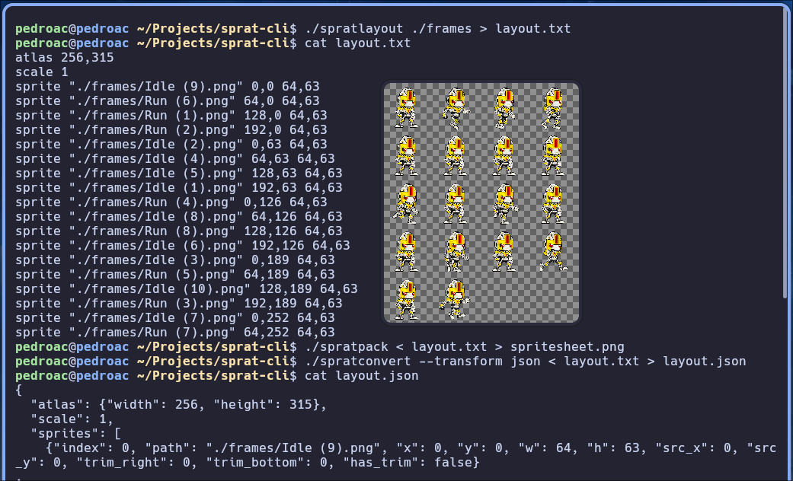

## Motivation

This project started after using TexturePacker and looking for free, open-source CLI tools to support a sprite sheet generation pipeline.

## Principles

- Keep it simple.
- Do one thing, and do it right.
- Prioritize output-driven workflows.
- Work naturally with `|` and `>`.
- Keep dependencies minimal.
- Automate setup during compilation when possible (for example, downloading dependencies).
- Input flexibility: accept sprite frames of any size.
- Prioritize generated image optimization for GPU usage over packing algorithm runtime.
- Focus on usefulness.
- No GUI: the CLI can later be used to build one.
- Be usable in command lines, CI/CD, and Git-based pipelines.
- Encourage AI-assisted workflows (for example, Codex) for faster iteration and maintenance.
- Stay open source and free.

## Getting started

Build:

```sh
cmake .
make
```

If `stb/` headers are missing and you want CMake to fetch them:

```sh
cmake -DSPRAT_DOWNLOAD_STB=ON -DSTB_REF=master .
make
```

Generate layout first (most common workflow):

```sh
./spratlayout ./frames > layout.txt
```

Inspect layout text:

```sh
head -n 20 layout.txt
```

Pack PNG from that layout:

```sh
./spratpack < layout.txt > spritesheet.png
```

Optional one-pipe run:

```sh
./spratlayout ./frames --trim-transparent --padding 2 | ./spratpack > spritesheet.png
```

Convert layout to JSON/CSV/XML/CSS:

```sh
./spratconvert --transform json < layout.txt > layout.json
```

Manual page:

```sh
man ./man/sprat-cli.1
```

## Build

```sh
cmake .
make
```

This builds three binaries:

- `spratlayout`
- `spratpack`
- `spratconvert`

Install binaries, man page, and global profile config:

```sh
sudo cmake --install .
```

## Test

Run the end-to-end pipeline test:

```sh
ctest --test-dir tests --output-on-failure
```

This test generates tiny PNG fixtures, runs `spratlayout` to produce layout text,
then runs `spratpack` and verifies the output is a valid PNG.

## Workflow

`spratlayout` scans a folder of input images (or a plaintext list of image paths) and prints a text layout to stdout:

```sh
./spratlayout ./frames > layout.txt
```

If the first argument is a file, `spratlayout` treats it as a newline-separated list of image paths. Blank lines and lines beginning with `#` are ignored. Relative paths are resolved relative to the list file, each path must exist, be a regular image file (`.png`, `.jpg`, `.bmp`, etc.), and they are loaded in the order listed; otherwise the command fails.

Profiles are flexible named rule sets. A profile groups packing rules (for example mode, optimize target, limits, padding, trim, scale, threads) under one name, so you can run `--profile NAME` instead of repeating many options each time.

Profile definitions are driven by `spratprofiles.cfg`. The lookup order is:

1. `--profiles-config PATH` (when provided)
2. `~/.config/sprat/spratprofiles.cfg`
3. `spratprofiles.cfg` in the same directory as `spratlayout`
4. Global installed config (from `make install`, typically `${prefix}/share/sprat/spratprofiles.cfg`)

Each `[profile name]` section can define:

- `mode=compact|pot|fast`
- `optimize=gpu|space`
- `max_width` and `max_height` (optional atlas limits)
- `padding` (integer >= 0)
- `max_combinations` (integer >= 0)
- `scale` (number > 0 and <= 1)
- `trim_transparent=true|false`
- `threads` (integer > 0)
- `source_resolution` (WxH)
- `target_resolution` (WxH or `source`)
- `resolution_reference=largest|smallest`

Add new sections to define custom profiles and refer to them with `--profile NAME`. Profile values are defaults; command options override them per run.

Examples (concept):

- `--profile mobile` applies the rules stored under `mobile`.
- `--profile mobile --padding 4` uses `mobile` and overrides only padding for that run.

`spratlayout` options:

- `--profile NAME` (default: `fast`)
- `--profiles-config PATH` (override the config file path; can be relative or absolute)
- `--mode compact|pot|fast`
- `--optimize gpu|space`
- `--padding N` (default: `0`)
- `--max-combinations N` (default: `0` = auto/unlimited; caps compact candidate trials)
- `--scale F` (default: `1`, valid range: `(0, 1]`; applies before resolution mapping)
- `--trim-transparent` / `--no-trim-transparent`
- `--max-width N` / `--max-height N` (optional atlas limits)
- `--threads N` (override worker count for compact profile search; default: auto)

Layout caching:

- `spratlayout` keeps metadata and output caches in the system temp directory (for example `/tmp` on Linux/macOS, `%TEMP%` on Windows).
- Cache entries are reused when inputs and options are unchanged.
- Cache entries older than one hour are pruned automatically.

Why these options help:

- `--padding N`: avoids texture bleeding/artifacts from sampling and subpixel math.
- `--scale F`: normalize intentionally oversized source sprites before target resolution mapping.
- `--trim-transparent`: removes empty borders to reduce atlas usage.
- `--max-width/--max-height`: enforce hardware/platform texture limits.
- `spratpack --frame-lines`: visual debug of sprite bounds, spacing, and overlaps.

Example recipes:

```sh
# 1) fast (default): quicker shelf-style packing
./spratlayout ./frames > layout_fast_default.txt

# 2) mobile: desktop behavior + default 2048x2048 atlas limits
./spratlayout ./frames --profile mobile > layout_mobile.txt

# 3) space: tighter area packing
./spratlayout ./frames --profile space > layout_space.txt

# 4) fast: quicker shelf-style packing
./spratlayout ./frames --profile fast > layout_fast.txt

# 5) legacy: POT-oriented output + default 1024x1024 limits
./spratlayout ./frames --profile legacy > layout_legacy.txt

# 6) css: shelf-style profile for CSS sprite workflows
./spratlayout ./frames --profile css > layout_css.txt
```

Size/quality recipes:

```sh
# Trim transparent borders before packing
./spratlayout ./frames --profile desktop --trim-transparent > layout_trim.txt

# Add 2px padding between sprites
./spratlayout ./frames --profile desktop --padding 2 > layout_padding.txt

# Hard atlas limits (max-width/max-height)
./spratlayout ./frames --profile desktop --max-width 800 --max-height 600 > layout_max_800x600.txt
```

Rendering recipes with frame lines:

```sh
# Draw sprite outlines on the packed sheet
./spratpack --frame-lines --line-width 1 --line-color 255,0,0 < layout_desktop.txt > spritesheet_lines.png

# End-to-end pipeline: layout + frame lines
./spratlayout ./frames --profile desktop --trim-transparent --padding 2 | \
  ./spratpack --frame-lines --line-width 2 --line-color 0,255,0 > spritesheet_pipeline_lines.png
```

Trim benchmark (repeatable local comparison):

```sh
./scripts/benchmark-trim.sh ./build/spratlayout ./frames 5
```

Scale recipe (smaller output for lower resolutions):

```sh
./spratlayout ./frames --profile mobile --scale 0.5 > layout_mobile_half.txt
./spratpack < layout_mobile_half.txt > spritesheet_mobile_half.png
```

Resolution-aware scale recipe:

```sh
./spratlayout ./frames --profile mobile \
  --source-resolution 3840x2160 --target-resolution 1920x1080 --scale 0.5 \
  > layout_mobile_targeted.txt
./spratpack < layout_mobile_targeted.txt > spritesheet_mobile_targeted.png
```

The output format is:

- `atlas <width>,<height>`
- `scale <factor>`
- `sprite "<path>" <x>,<y> <w>,<h>`

When `--trim-transparent` is enabled, sprite lines include crop offsets:

- `sprite "<path>" <x>,<y> <w>,<h> <left>,<top> <right>,<bottom>`

Example output from:

```sh
./spratlayout ./frames --trim-transparent > layout.txt
```

```txt
atlas 1631,1963
scale 1
sprite "./tests/png/Run (6).png" 0,0 335,495 109,54 123,7
sprite "./tests/png/RunShoot (6).png" 345,0 373,495 109,54 85,7
sprite "./tests/png/RunShoot (2).png" 728,0 362,492 121,54 84,10
```

## Layout transforms (`spratconvert`)

`spratconvert` reads layout text from stdin and writes transformed output to stdout.
The term `transform` is used because conversion is template-driven and data-oriented.

List built-in transforms:

```sh
./spratconvert --list-transforms
```

Use a built-in transform:

```sh
./spratconvert --transform json < layout.txt > layout.json
./spratconvert --transform csv < layout.txt > layout.csv
./spratconvert --transform xml < layout.txt > layout.xml
./spratconvert --transform css < layout.txt > layout.css
```

Optional extra data files:

```sh
./spratconvert --transform json --markers markers.json --animations animations.json < layout.txt > layout.json
```

Built-in transform files live in `transforms/`:

- `transforms/json.transform`
- `transforms/csv.transform`
- `transforms/xml.transform`
- `transforms/css.transform`

Each transform is section-based:

- Use explicit open/close tags for sections, for example `[meta]` ... `[/meta]`.
- `[meta]` for metadata like `name`, `description`, `extension`
- `[header]` printed once before sprites
- `[if_markers]` / `[if_no_markers]` conditional blocks based on marker items
- `[markers_header]`, `[markers]`, `[marker]`, `[markers_separator]`, `[markers_footer]` marker loop sections
- `[sprites]` container with `[sprite]` item template repeated for each sprite (required)
- `[separator]` inserted between sprite entries
- `[if_animations]` / `[if_no_animations]` conditional blocks based on animation items
- `[animations_header]`, `[animations]`, `[animation]`, `[animations_separator]`, `[animations_footer]` animation loop sections
- `[footer]` printed once after sprites

Common placeholders:

- `{{atlas_width}}`, `{{atlas_height}}`, `{{scale}}`, `{{sprite_count}}`
- `{{index}}`, `{{name}}`, `{{path}}`, `{{x}}`, `{{y}}`, `{{w}}`, `{{h}}`
- `{{src_x}}`, `{{src_y}}`, `{{trim_left}}`, `{{trim_top}}`, `{{trim_right}}`, `{{trim_bottom}}`
- Escaped sprite fields: `{{name_json}}`, `{{name_csv}}`, `{{name_xml}}`, `{{name_css}}`, `{{path_json}}`, `{{path_csv}}`, `{{path_xml}}`, `{{path_css}}`
- Per-sprite markers: `{{sprite_markers_count}}`, `{{sprite_markers_json}}`, `{{sprite_markers_csv}}`, `{{sprite_markers_xml}}`, `{{sprite_markers_css}}`
- Marker loop placeholders:
  - `{{marker_index}}`, `{{marker_name}}`, `{{marker_type}}`
  - `{{marker_x}}`, `{{marker_y}}`, `{{marker_radius}}`, `{{marker_w}}`, `{{marker_h}}`
  - `{{marker_vertices}}`, `{{marker_vertices_json}}`, `{{marker_vertices_csv}}`, `{{marker_vertices_xml}}`, `{{marker_vertices_css}}`
  - `{{marker_sprite_index}}`, `{{marker_sprite_name}}`, `{{marker_sprite_path}}`
- Animation loop placeholders:
  - `{{animation_index}}`, `{{animation_name}}`
  - `{{animation_sprite_count}}`, `{{animation_sprite_indexes}}`, `{{animation_sprite_indexes_json}}`, `{{animation_sprite_indexes_csv}}`
- Extra file placeholders:
  - `{{has_markers}}`, `{{has_animations}}`, `{{marker_count}}`, `{{animation_count}}`
  - `{{markers_path}}`, `{{animations_path}}`
  - `{{markers_raw}}`, `{{animations_raw}}`
  - `{{markers_json}}`, `{{markers_csv}}`, `{{markers_xml}}`, `{{markers_css}}`
  - `{{animations_json}}`, `{{animations_csv}}`, `{{animations_xml}}`, `{{animations_css}}`

Sprite names default to the source file basename without extension (for example `./frames/run_01.png` becomes `run_01`).

`--markers` expects JSON with sprite associations. `markers` must be an array of objects with at least `name` and `type`.
Supported marker types:
- `point`: `x`, `y`
- `circle`: `x`, `y`, `radius`
- `rectangle`: `x`, `y`, `w`, `h`
- `polygon`: `vertices` (ordered list of `{x,y}` objects)
Example: `{"sprites":{"./frames/a.png":{"markers":[{"name":"hit","type":"point","x":3,"y":5}]}}}`.
`--animations` expects JSON timelines (for example `{"timelines":[{"name":"run","frames":["./frames/a.png","b"]}]}`), and frame entries are resolved to sprite indexes by path or sprite name.

Custom transform example:

```ini
[meta]
name=compact-log
[/meta]

[header]
atlas={{atlas_width}}x{{atlas_height}} sprites={{sprite_count}}
[/header]

[sprites]
  [sprite]
{{index}} {{path}} @ {{x}},{{y}} {{w}}x{{h}}
  [/sprite]
[/sprites]

[separator]
;
[/separator]

[footer]

done
[/footer]
```

Run custom transform:

```sh
./spratconvert --transform ./my.transform < layout.txt > layout.custom.txt
```

Column meanings for the `sprite` line in trim mode:

- `"<path>"`: source image path.
- `<x>,<y>`: top-left position in the output atlas where the trimmed sprite is placed.
- `<w>,<h>`: trimmed width and height written into the atlas.
- `<left>,<top>`: pixels trimmed from the left and top of the original image.
- `<right>,<bottom>`: pixels trimmed from the right and bottom of the original image.

`spratpack` reads that layout from stdin and writes the final PNG spritesheet to stdout:

```sh
./spratpack < layout.txt > spritesheet.png
```

Optional frame divider overlay:

- `--frame-lines` (draw sprite rectangle outlines)
- `--line-width N` (default: `1`)
- `--line-color R,G,B[,A]` (default: `255,0,0,255`)
- `--threads N` (parallel sprite decode/blit when sprite rectangles do not overlap)

Example:

```sh
./spratpack --frame-lines --line-width 2 --line-color 0,255,0 < layout.txt > spritesheet.png
```

You can also pipe both commands directly:

```sh
./spratlayout ./frames | ./spratpack > spritesheet.png
```

License for third-party art is defined by the asset author; verify terms before redistribution.

## Image Samples

To regenerate these images:

```sh
./scripts/regenerate-readme-assets.sh
```

What the script does:

- Downloads `https://opengameart.org/sites/default/files/RobotFree.zip`
- Extracts PNG frames into `README-assets/frames`
- Reduces frame sizes with ImageMagick (`FRAME_MAX_SIZE`, default `64x64>`)
- Generates spritesheets from those reduced frames (without resizing output sheets)
- Generates one image per command in `Example recipes` (`recipe-01-...png` to `recipe-12-...png`)

Sample asset source used in this page: https://opengameart.org/content/the-robot-free-sprite

Recipe 1: Desktop (`./spratlayout ./frames --profile desktop > layout_desktop.txt`)

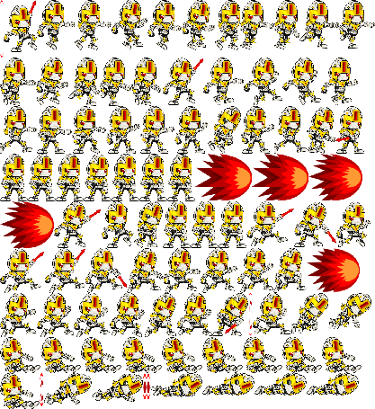

Recipe 2: Mobile (`./spratlayout ./frames --profile mobile > layout_mobile.txt`)

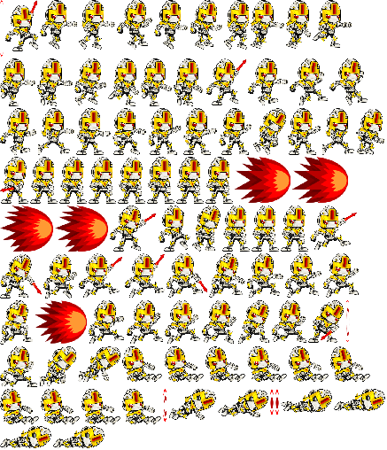

Recipe 3: Space (`./spratlayout ./frames --profile space > layout_space.txt`)


Recipe 4: Fast (`./spratlayout ./frames --profile fast > layout_fast.txt`)

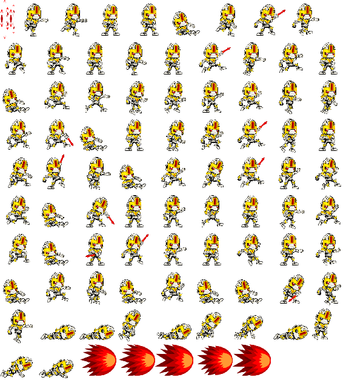

Recipe 5: Legacy (`./spratlayout ./frames --profile legacy > layout_legacy.txt`)

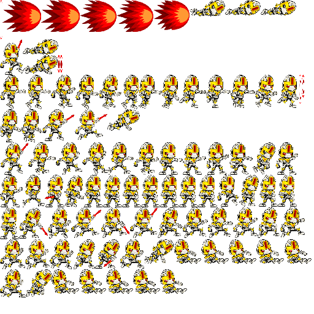

Recipe 6: CSS (`./spratlayout ./frames --profile css > layout_css.txt`)


Recipe 7: Trim (`./spratlayout ./frames --profile desktop --trim-transparent > layout_trim.txt`)

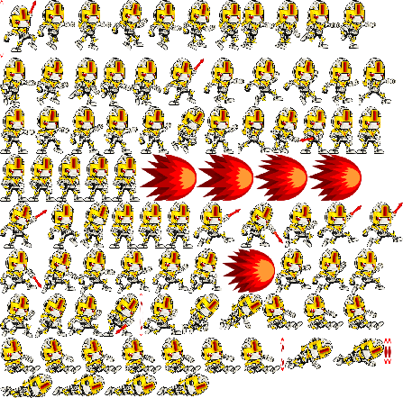

Recipe 8: Padding (`./spratlayout ./frames --profile desktop --padding 2 > layout_padding.txt`)

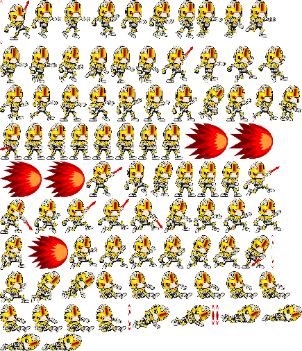

Recipe 9: Max 1024 (`./spratlayout ./frames --profile desktop --max-width 1024 --max-height 1024 > layout_1024.txt`)

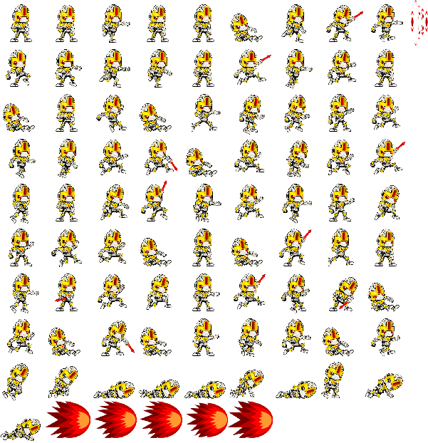

Recipe 10: Mobile Tuned (`./spratlayout ./frames --profile mobile --trim-transparent --padding 2 --max-width 2048 --max-height 2048 > layout_mobile_tuned.txt`)

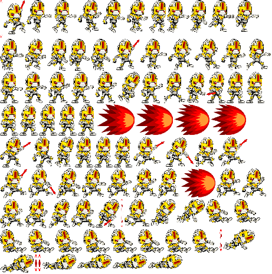

Recipe 11: Frame Lines (`./spratpack --frame-lines --line-width 1 --line-color 255,0,0 < layout_desktop.txt > spritesheet_lines.png`)

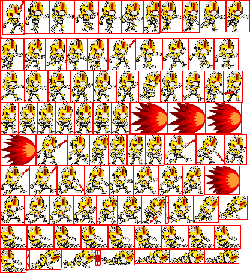

Recipe 12: Pipeline Lines (`./spratlayout ./frames --profile desktop --trim-transparent --padding 2 | ./spratpack --frame-lines --line-width 2 --line-color 0,255,0 > spritesheet_pipeline_lines.png`)

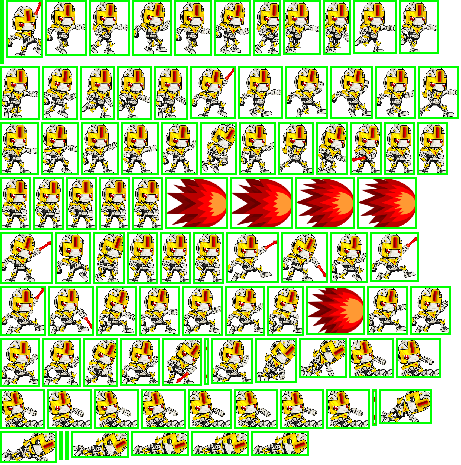

## Free Sprite Sources

- https://kenney.nl/assets (CC0/public-domain-style game assets)
- https://opengameart.org/ (mixed licenses, check each pack)
- https://itch.io/game-assets/free/tag-sprites (license varies by author)

## Texture Optimization References

Shape and layout:

- https://en.wikipedia.org/wiki/Texture_atlas (texture atlas overview)
- https://github.com/juj/RectangleBinPack (MaxRects and related bin-packing approaches)
- https://www.khronos.org/opengl/wiki/Texture (mipmaps, filtering, and texture behavior)

Color formats and precision:

- https://www.khronos.org/opengl/wiki/Image_Format (normalized, integer, float, and sRGB formats)
- https://learn.microsoft.com/windows/win32/direct3ddds/dx-graphics-dds-pguide (DDS format/container guidance)

Compression formats:

- https://www.khronos.org/opengl/wiki/S3_Texture_Compression (S3TC/BC-style compression in OpenGL)
- https://learn.microsoft.com/windows/win32/direct3d11/texture-block-compression-in-direct3d-11 (BC1-BC7 overview and tradeoffs)

Sampling artifacts and alpha:

- https://learnopengl.com/Advanced-OpenGL/Blending (alpha blending behavior)
- https://learnopengl.com/Advanced-OpenGL/Anti-Aliasing (sampling and edge artifacts)

Platform and engine guidance:

- https://docs.vulkan.org/guide/latest/ (modern cross-platform texture usage guidance)
- https://docs.unity3d.com/Manual/class-TextureImporter.html (Unity import/compression settings)

## Contributing

Suggestions, pull requests, and forks are welcome.

High-impact contribution areas:

- Packaging and distribution:
  - Linux packages (deb/rpm), Homebrew formulae, Scoop/Chocolatey, Arch/AUR, Nix, etc.
  - Release automation and artifact publication for multiple platforms.
- GUI frontends:
  - Desktop/web/mobile wrappers around the CLI pipeline.
  - Workflow-focused tools that call `spratlayout`, `spratpack`, and `spratconvert` under the hood.
- Engine/runtime integrations:
  - Importers/exporters and transform templates for specific game engines or frameworks.
  - Community-maintained presets and examples.
- CI/CD and developer tooling:
  - Cross-platform build/test matrices.
  - Reproducible packaging and versioned release pipelines.

Core scope remains a free UNIX-style CLI. GUI and platform integrations are encouraged as companion projects or optional layers.

## License

MIT. See [LICENSE](LICENSE).

## Support

[](https://buymeacoffee.com/pedroac)
