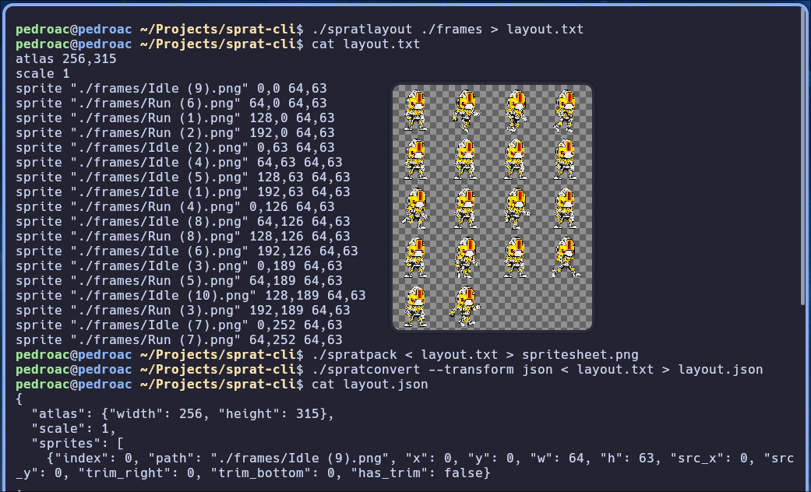
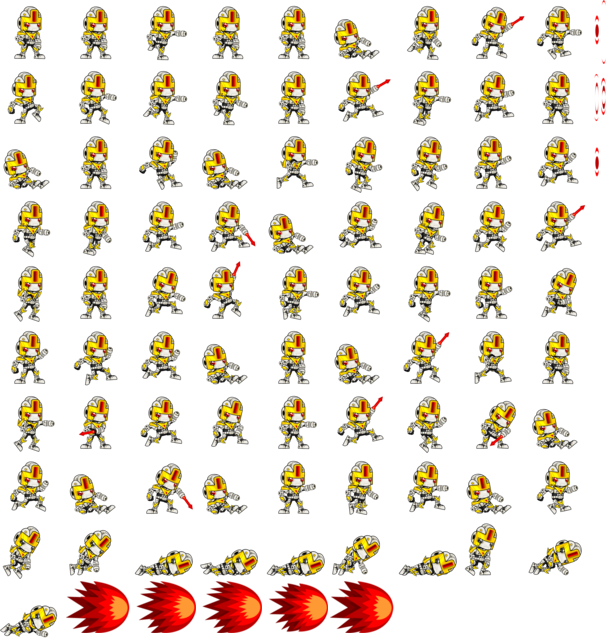
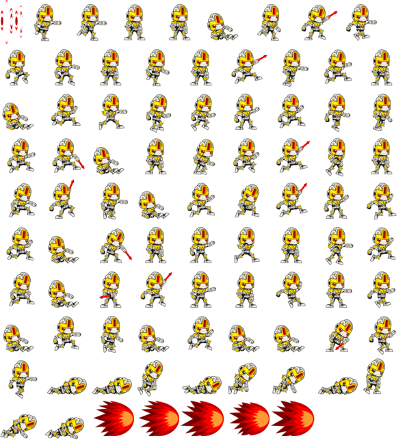
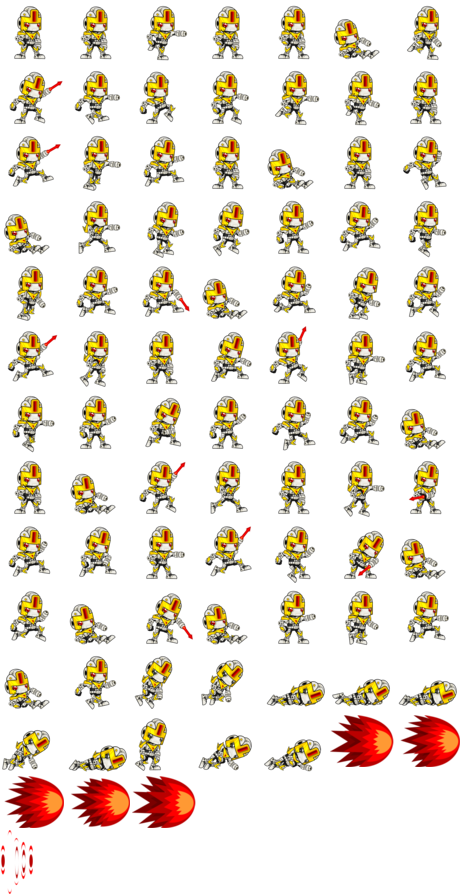
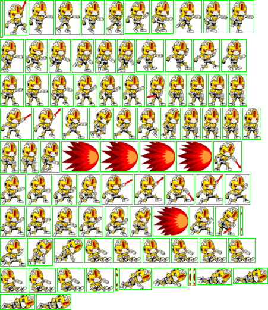
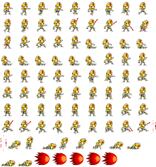
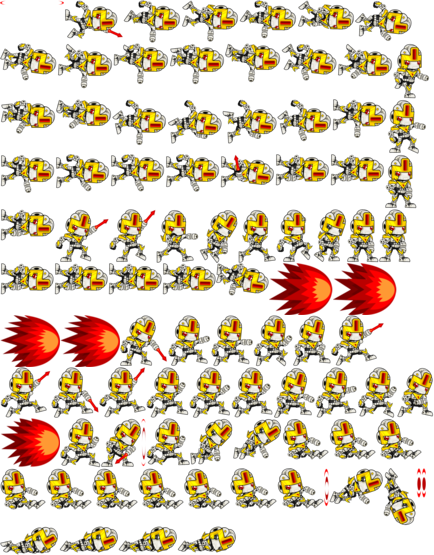

# sprat-cli

**The UNIX-way sprite sheet generator.**



`sprat-cli` is a modular toolkit for generating sprite sheets (texture atlases) from the command line. Unlike monolithic GUI tools, it splits the packing process into discrete, pipeable commands (`spratlayout`, `spratpack`, `spratconvert`, `spratframes`, `spratunpack`). This makes it perfect for:

*   **CI/CD Pipelines**: Automate asset generation in your build process.
*   **Shell Scripting**: Integrate naturally with `|`, `>`, and standard text tools.
*   **Game Development**: Optimized packing algorithms for GPU memory.
*   **Web & Apps**: Export to CSS, JSON, XML, or custom formats.

---

## 🚀 Quick Start

**Build:**

```sh
sh build.sh
```

The binaries are generated in the `build/` directory. You can run them directly from there:

Generate layout first:

```sh
./build/spratlayout ./frames > layout.txt
```

Inspect layout text:

```sh
cat layout.txt
```

Pack PNG from that layout:

```sh
./build/spratpack < layout.txt > spritesheet.png
```

Optional one-pipe run:

```sh
./build/spratlayout ./frames --trim-transparent --padding 2 | ./build/spratpack > spritesheet.png
```

**New: Tar File Support**

`spratlayout` now accepts tar archives as input. This is useful for bundling sprite assets or working with compressed archives.

```sh
# Regular tar file
./build/spratlayout sprites.tar > layout.txt

# Compressed tar files (gzip, bzip2, xz)
./build/spratlayout sprites.tar.gz > layout.txt
./build/spratlayout sprites.tar.bz2 > layout.txt
./build/spratlayout sprites.tar.xz > layout.txt
```

The tool automatically extracts the archive to a temporary directory and processes all image files found within. Temporary directories are cleaned up automatically after processing.

Convert layout to JSON/CSV/XML/CSS:

```sh
./build/spratconvert --transform json < layout.txt > layout.json
```

Detect sprite frames in spritesheets:

```sh
./build/spratframes spritesheet.png > frames.spratframes
```

Extract sprites from spritesheets using frame coordinates:

```sh
./build/spratunpack spritesheet.png --frames frames.spratframes --output output/
```

Manual page:

```sh
man ./man/sprat-cli.1
```

Per-command help:

```sh
./build/spratlayout --help
./build/spratpack --help
./build/spratconvert --help
./build/spratframes --help
./build/spratunpack --help
```

## Installation

Install binaries, man page, and global profile config:

```sh
sudo cmake --install build
```

## Workflow

`sprat-cli` follows the UNIX philosophy: each tool does one thing well and communicates via text. The standard pipeline consists of three steps:

                    ┌───────────────────────────┐
                    │       IMAGE FOLDER        │
                    │        ./frames           │
                    └─────────────┬─────────────┘
                                  │
                                  ▼
                        ┌─────────────────┐
                        │   spratlayout   │
                        │   (scanning)    │
                        │  math only      │
                        └────────┬────────┘
                                 │  stdout
                                 ▼
                           layout.txt
                                 │
              ┌──────────────────┴──────────────────┐
              ▼                                     ▼
     ┌─────────────────┐                   ┌─────────────────┐
     │    spratpack    │                   │  spratconvert   │
     │    (packing)    │                   │ (transforming)  │
     │  layout → PNG   │                   │ layout → JSON   │
     └────────┬────────┘                   └────────┬────────┘
              │ stdout                              │ stdout
              ▼                                     ▼
     spritesheet.png                          layout.json

### 1. Scanning (`spratlayout`)
Scans a folder of images and calculates their optimal positions. It prints a **layout text** to stdout. This step is mathematical and does not process image pixels, making it extremely fast.
```sh
./build/spratlayout ./frames > layout.txt
```

### 2. Packing (`spratpack`)
Reads the layout text from stdin, loads the images, and blits them into a single PNG atlas.
```sh
./build/spratpack < layout.txt > spritesheet.png
```

### 3. Transforming (`spratconvert`)
Reads the layout text and transforms it into a metadata format (JSON, CSV, XML, etc.) for your game engine.
```sh
./build/spratconvert --transform json < layout.txt > layout.json
```

### Extra: Deconstruction (Reverse Engineering)
             ┌──────────────────────────┐
             │   existing_sheet.png     │
             └─────────────┬────────────┘
                           │
                           ▼
                    ┌──────────────┐
                    │ spratframes  │
                    │  (detect)    │
                    └───────┬──────┘
                            │ stdout
                            ▼
                        frames.txt
                            │
                            ▼
                    ┌──────────────┐
                    │ spratunpack  │
                    │  (unpack)    │
                    └───────┬──────┘
                            ▼
                    ./recovered_frames
                            │
                            ▼
                       (feeds into)
                       spratlayout
If you start with a monolithic spritesheet and need to recover individual frames:

**The One-liner (Recommended):**
```sh
./build/spratframes sheet.png | ./build/spratunpack --output ./recovered_frames
```

**Step-by-step (if you need to edit the layout first):**
1.  **Detect (`spratframes`)**: Scans an existing spritesheet and prints a layout definition to stdout.
    ```sh
    ./build/spratframes existing_sheet.png > frames.txt
    ```
2.  **Unpack (`spratunpack`)**: Takes the sheet and the detected frames to extract individual images.
    ```sh
    ./build/spratunpack existing_sheet.png --frames frames.txt --output ./recovered_frames
    ```
Now you can use `./recovered_frames` as the input for `spratlayout`.

---

## Configuration & Profiles

### Profiles
Profiles are named rule sets that group packing options (mode, padding, scale, etc.). Instead of passing ten flags to `spratlayout`, you can define a profile in `spratprofiles.cfg` and use it with `--profile NAME`.

Profile definitions are searched in:
1. `--profiles-config PATH` (CLI override)
2. `{exe_dir}/spratprofiles.cfg` (beside the executable, portable install)
3. User config:
   - Linux: `$XDG_CONFIG_HOME/sprat/spratprofiles.cfg` (default `~/.config/sprat/`)
   - macOS: `~/Library/Application Support/sprat/spratprofiles.cfg`
   - Windows: `%APPDATA%\sprat\spratprofiles.cfg`
4. `/usr/local/share/sprat/spratprofiles.cfg` (Global)

### Spratlayout Options
- `--mode compact|pot|fast`: Packing algorithm choice.
- `--optimize gpu|space`: Prioritize GPU-friendly dimensions or minimum area.
- `--max-width N`: Maximum atlas width.
- `--max-height N`: Maximum atlas height.
- `--no-max-width`: Disable max width limit even if profile sets one.
- `--no-max-height`: Disable max height limit even if profile sets one.
- `--padding N`: Pixels between sprites to prevent texture bleeding.
- `--extrude N`: Repeat edge pixels N times (requires padding >= extrude * 2).
- `--trim-transparent`: Remove empty borders to save space.
- `--rotate`: Allow 90-degree rotation during packing for tighter layouts.
- `--multipack`: Enable multi-atlas candidate search and splitting.
- `--deduplicate`: Hash-detect identical sprites and create aliases (saves atlas space).
- `--sort name|none`: Order of sprites in layout (default: `name` for folders, `none` for stdin).
- `--scale F`: Pre-scale images (0.0 to 1.0).
- `--threads N`: Parallelize the packing search.
- `--debug`: Enable detailed error reporting and debug visualization.
- Directory inputs honor `.spratlayoutignore`; list files may include `exclude "path"` entries.

### Layout Caching
`spratlayout` automatically caches image metadata in the system temp directory. If your source images haven't changed, subsequent runs will be nearly instantaneous. Entries older than one hour are pruned automatically.

### Duplicate Detection
Detect and alias identical sprites to save atlas space. When `--deduplicate` is used, `spratlayout` computes a content hash of each image and creates aliases for duplicates, packing only one canonical copy per unique content.

```sh
# Generate layout with duplicate detection
./build/spratlayout ./frames --deduplicate > layout.txt
```

The layout file will contain `alias` lines for duplicates:
```
sprite "original.png" 0,0 32,32
alias "duplicate.png" "original.png"
```

When converting to JSON/metadata, aliases are expanded:
```sh
./build/spratlayout ./frames --deduplicate | ./build/spratconvert --transform json > layout.json
```

The output JSON will reference the canonical sprite path in the `alias_of` field for duplicate entries. This feature is especially useful for large asset collections with repeated sprites, reducing both atlas size and build time.

---

## Multipacking

Use `--multipack` to allow splitting across multiple atlases. With explicit max limits, splitting is constrained by those limits. With limits disabled, `--optimize` still influences whether one or more atlases are selected.

```sh
# Force small atlases to trigger multipack
./build/spratlayout ./frames --max-width 512 --max-height 512 --multipack > layout.txt
```

The layout file will contain multiple `atlas` lines. `spratpack` can then generate multiple PNG files:

```sh
# Output atlas_0.png, atlas_1.png, etc.
./build/spratpack -a atlas_%d.png < layout.txt
```

You can also extract a specific atlas index:
```sh
./build/spratpack --atlas-index 1 < layout.txt > second_atlas.png
```

---

## Packing Examples

### Compact Mode (GPU Optimized)

Default behavior. Tries to keep the atlas square-ish but prioritizes width/height that fits well in GPU memory.

!Compact GPU

```sh
./build/spratlayout ./frames --mode compact --optimize gpu --padding 2 > layout.txt
./build/spratpack < layout.txt > compact_gpu_pad2.png
```


### Compact Mode (Space Optimized)

Tries to minimize total area, regardless of aspect ratio.

```sh
./build/spratlayout ./frames --mode compact --optimize space --padding 2 > layout.txt
./build/spratpack < layout.txt > compact_space.png
```


### Fast Mode

Uses a shelf packing algorithm. Much faster for huge datasets, but less efficient packing.

```sh
./build/spratlayout ./frames --mode fast --padding 2 > layout.txt
./build/spratpack < layout.txt > fast.png
```


### Power of Two (POT)

Forces the output atlas to be a power of two (e.g., 512x512, 1024x512).

```sh
./build/spratlayout ./frames --mode pot --padding 2 > layout.txt
./build/spratpack < layout.txt > pot.png
```


### Trimming Transparency

Removes transparent pixels from sprite edges. `spratpack` can draw frame lines to visualize the trimmed bounds or apply `--extrude` to avoid sampling artifacts on edges.

```sh
./build/spratlayout ./frames --trim-transparent --padding 2 --extrude 1 > layout.txt
./build/spratpack < layout.txt > spritesheet.png
```


### Resolution Mapping

Automatically scales sprites based on a target resolution. Useful for multi-platform builds (e.g., designing for 4K, building for 1080p).

```sh
# Scale = 1920 / 3840 = 0.5
./build/spratlayout ./frames \
  --source-resolution 3840x2160 \
  --target-resolution 1920x1080 \
  --padding 2 > layout.txt
./build/spratpack < layout.txt > resolution.png
```


### Rotation

Allows 90-degree clockwise rotation of sprites to achieve even tighter packing.

```sh
./build/spratlayout ./frames --rotate --trim-transparent > layout.txt
./build/spratpack < layout.txt > rotation.png
```


## Complete Optimization Workflow

Here's an example combining multiple features for maximum optimization:

```sh
# 1. Generate layout with deduplication and trimming
./build/spratlayout ./frames \
  --deduplicate \
  --trim-transparent \
  --padding 2 \
  --extrude 1 \
  --multipack \
  > layout.txt

# 2. Pack with artifact reduction (dilation) and zopfli compression
./build/spratpack \
  --dilate 1 \
  --zopfli \
  --frame-lines \
  < layout.txt > spritesheet.png

# 3. Generate metadata for game engine
./build/spratconvert \
  --transform json \
  --auto-animations \
  < layout.txt > layout.json
```

This pipeline:
- Removes duplicate sprites (saves atlas space)
- Trims transparent borders (reduces pixel bloat)
- Adds safe padding/extrusion (prevents sampling artifacts)
- Enables dilation (bleeds colors to prevent halos)
- Compresses with Zopfli (smallest possible file)
- Generates game-ready metadata with animations

For GPU-native compression (when libsquish is available):
```sh
./build/spratlayout ./frames --deduplicate --trim-transparent --padding 2 | \
./build/spratpack --dilate 1 --gpu-compress dxt5 > atlas.dds
```

---

## Advanced Packing (`spratpack`)

### Zopfli Compression
Produce smaller PNGs using the Zopfli algorithm. It is significantly slower but provides better compression than standard deflate.
```sh
./build/spratpack --zopfli < layout.txt > optimized.png
```

### Protection & Obfuscation
Protect your assets with basic XOR-based obfuscation.
```sh
./build/spratpack --protect < layout.txt > protected.png
```
`spratunpack` and other tools in the suite automatically handle de-obfuscation when they detect the "SPRAT!" signature.

### Artifact Reduction (Dilation)
Prevent dark halos around sprites in GPU bilinear filtering by bleeding opaque pixel colors into adjacent transparent pixels.
```sh
# Single pass dilation
./build/spratpack --dilate 1 < layout.txt > dilated.png

# Multiple passes for stronger effect
./build/spratpack --dilate 2 < layout.txt > dilated.png
```
The `--dilate N` flag performs N passes of color dilation around each sprite, filling transparent borders with RGB values from opaque neighbors while keeping alpha at 0. This is essential when using `--extrude` or padding, as GPU sampling can pull transparent pixels at edges.

### Hardware Texture Compression
Compress atlases to GPU-native DXT formats (requires libsquish library).
```sh
# Compress to DXT1 (RGB, best compression)
./build/spratpack --gpu-compress dxt1 < layout.txt > atlas.dds

# Compress to DXT5 (RGBA with alpha channel)
./build/spratpack --gpu-compress dxt5 < layout.txt > atlas.dds
```
DXT/BC compression provides 4:1 or 6:1 compression ratios and loads directly into GPU memory without decompression. Atlas dimensions must be multiples of 4 for DXT compatibility. Requires libsquish:
- **Ubuntu/Debian**: `apt install libsquish-dev`
- **macOS**: `brew install squish`
- **Windows** (vcpkg): `squish` package in `vcpkg.json`

When libsquish is not available, `--gpu-compress` will error with a helpful message.

### Nine-Slice (Slice) Metadata
Annotate sprites with nine-slice insets and per-axis fill modes for UI scaling. Add a `slice=` token to any sprite line in the layout:

```
slice=L,T,R,B[,H_MODE,V_MODE]
```

- `L,T,R,B` — non-negative integer insets (left, top, right, bottom) defining the nine-slice grid.
- `H_MODE,V_MODE` — optional fill modes for the horizontal and vertical stretchable regions. Valid values: `stretch` (default), `repeat`, `mirror`.

Examples:
```
sprite "panel.png" 0,0 64,64 slice=8,8,8,8
sprite "border.png" 0,0 64,64 slice=8,8,8,8,repeat,stretch
sprite "frame.png" 0,0 64,64 slice=10,12,10,12,mirror,mirror
```

When `slice=` is present, `spratconvert` emits `slice_left`, `slice_top`, `slice_right`, `slice_bottom`, `slice_h`, and `slice_v` fields per sprite in the transform data.

### Per-sprite Dithering & Quantization
Advanced users can manually edit `layout.txt` to apply per-sprite effects.
- `dither`: Enables ordered dithering for the sprite.
- `colors=N`: Quantizes the sprite to N colors (2-256).

Example layout line:
`sprite "./frames/robot.png" 0,0 128,128 dither colors=16`

---

## Layout transforms (`spratconvert`)

`spratconvert` reads layout text from stdin and writes transformed output to stdout.
Transforms are [Jsonnet](https://jsonnet.org/) files that receive the full layout data and produce any text format for your game engine or pipeline.

List built-in transforms:

```sh
./build/spratconvert --list-transforms
```

Use a built-in transform:

```sh
./build/spratconvert --transform json < layout.txt > layout.json
```

Provide `--atlas` so atlas paths are deterministic in multi-atlas layouts:

```sh
./build/spratconvert --transform json --atlas atlas_%d.png < layout.txt > layout.json
```

### Automatic Animations
Automatically group sprites into animations based on their filenames (e.g., `hero_walk_01.png`, `hero_walk_02.png` -> animation `hero_walk`).
```sh
./build/spratconvert --transform json --auto-animations < layout.txt > layout.json
```

### Pivot Points
Define pivot points (anchors) for sprites using markers.
1.  **Per-sprite pivot**: Add a marker named `pivot` of type `point` to a specific sprite.
2.  **Global pivot**: Add a marker named `pivot` of type `point` without a `path`.

`spratconvert` resolves pivot positions and exposes them as `pivot_x`, `pivot_y`, `pivot_x_norm`, `pivot_y_norm`, and `pivot_y_norm_raw` on each sprite object.

Example `markers.txt`:
```txt
# Global default pivot
- marker "pivot" point 16,16

path "./frames/hero.png"
# Specific pivot for hero
- marker "pivot" point 32,64
```

Optional extra data files:

```sh
./build/spratconvert --transform json --markers markers.txt --animations animations.txt < layout.txt > layout.json
```

### Transform search paths

Transform files are searched in:
1. `{exe_dir}/transforms/` (beside the executable, portable install)
2. User data dir:
   - Linux: `$XDG_DATA_HOME/sprat/transforms/` (default `~/.local/share/sprat/transforms/`)
   - macOS: `~/Library/Application Support/sprat/transforms/`
   - Windows: `%APPDATA%\sprat\transforms\`
3. `/usr/local/share/sprat/transforms/` (Global)

### Built-in transforms

| Name | Output | Notes |
|------|--------|-------|
| `json` | JSON | Generic metadata: sprites, atlases, animations, markers |
| `csv` | CSV | Flat spreadsheet-friendly list |
| `xml` | XML | Generic XML |
| `css` | CSS | CSS sprite sheet |
| `aseprite` | JSON | Aseprite JSON Array format; frameTags built from animations (non-contiguous animations become multiple tags) |
| `libgdx` | Text | LibGDX Atlas format; handles multipack |
| `godot` | JSON | Godot SpriteFrames resource |
| `phaser-hash` | JSON | Phaser 3 hash-keyed sprite sheet |
| `phaser-array` | JSON | Phaser 3 array-keyed sprite sheet |
| `phaser-anims` | JSON | Phaser 3 animation config |
| `plist` | plist | Apple / TexturePacker plist |
| `unity` | Group | `unity.json` + `unity.meta` + one `unity.anim` per animation; requires `--output-dir` |

### Transform format

Each transform is a Jsonnet file that evaluates to a JSON object:

- `name` — display name
- `description` — shown by `--list-transforms`
- `extension` — output file extension (e.g. `".json"`)
- `content` — string output for a single file
- `files` — array of `{filename, content}` for multi-file output; mutually exclusive with `content`, requires `--output-dir`

The layout data is available as `std.extVar("sprat")`:

```jsonnet
local sprat = std.extVar("sprat");
```

**Global fields:**

| Field | Type | Description |
|---|---|---|
| `sprites` | array | All sprites across all atlases |
| `atlases` | array | Each entry has `index`, `width`, `height`, `path`, `sprites` |
| `animations` | array | Animation definitions |
| `markers` | array | All markers across all sprites |
| `atlas_width`, `atlas_height` | number | First atlas dimensions |
| `atlas_path`, `atlas_stem` | string | First atlas path and stem |
| `atlas_count` | number | Total atlas count |
| `multipack` | boolean | `true` when layout declares `multipack true` |
| `scale`, `extrude` | number | Layout-level values |
| `has_animations`, `has_markers` | boolean | Whether extra files were loaded |
| `animation_count`, `marker_count`, `sprite_count` | number | Counts |
| `output_stem`, `output_stem_hash_hex` | string | Output stem and its FNV-1a hex hash |
| `animations_path`, `markers_path` | string | Paths to the extra files |

**Per sprite (`sprites[]`):**

| Field | Description |
|---|---|
| `index`, `name`, `path`, `atlas_index` | Identity |
| `x`, `y`, `w`, `h` | Packed rectangle in the atlas |
| `content_w`, `content_h` | Dimensions accounting for rotation |
| `source_w`, `source_h` | Original size including trim margins |
| `trim_left`, `trim_top`, `trim_right`, `trim_bottom`, `has_trim` | Trim margins |
| `rotated` | `true` when packed rotated 90° clockwise |
| `slice_left`, `slice_top`, `slice_right`, `slice_bottom` | Nine-slice insets (only present when `has_slice` is true) |
| `slice_h`, `slice_v` | Per-axis fill mode: `stretch`, `repeat`, or `mirror` (only present when `has_slice` is true) |
| `unity_y` | `atlas_height - y - h` (Y-up coordinate for Unity) |
| `pivot_x`, `pivot_y` | Pivot in pixels from marker lookup (0 if not set) |
| `pivot_x_norm`, `pivot_y_norm` | Normalized; `pivot_y_norm` is Y-up (Unity convention) |
| `pivot_y_norm_raw` | Normalized Y-down |
| `name_hash_hex` | 16-char FNV-1a hex string |
| `name_hash_decimal` | FNV-1a as a decimal string (serialized as JSON string to avoid float precision loss) |
| `name_css` | CSS-safe identifier |
| `markers` | Array of marker objects attached to this sprite |

**Per animation (`animations[]`):**

| Field | Description |
|---|---|
| `index`, `name`, `fps`, `duration` | Identity and timing |
| `frame_indices` | Global sprite index sequence (may be non-contiguous) |
| `frames` | `[{index, name, name_hash_decimal, name_hash_hex}]` resolved per frame |
| `is_alias`, `alias_source`, `flip` | Alias support |

**Per marker (`markers[]` and `sprite.markers[]`):**

| Field | Description |
|---|---|
| `index`, `name`, `type` | Identity; `type` is `point`, `circle`, `rectangle`, or `polygon` |
| `x`, `y`, `radius`, `w`, `h`, `vertices` | Geometry (fields present depend on type) |
| `sprite_index`, `sprite_name`, `sprite_path` | Owning sprite |

### Shared helpers (`sprat.libsonnet`)

All transforms in the transforms directory can import shared helpers:

```jsonnet
local lib = import "sprat.libsonnet";
```

- `lib.format_double(v)` — formats a float like C's `%.8g` (works around a known Jsonnet v0.20 `%g` bug)
- `lib.consecutive_runs(indices)` — splits an index array into contiguous ranges `[{from, to}]`; used by the Aseprite transform to build frameTags from non-contiguous animations

### Custom transforms

A transform is any `.jsonnet` file. Pass a path directly to `--transform`:

```jsonnet
local sprat = std.extVar("sprat");
{
  name: "compact-log",
  description: "One line per sprite",
  extension: ".txt",
  content:
    "atlas=%dx%d sprites=%d\n" % [sprat.atlas_width, sprat.atlas_height, sprat.sprite_count] +
    std.join("\n", [
      "%d %s @ %d,%d %dx%d" % [s.index, s.path, s.x, s.y, s.w, s.h]
      for s in sprat.sprites
    ]) + "\n",
}
```

```sh
./build/spratconvert --transform ./my.jsonnet < layout.txt > output.txt
```

Multi-file output — return `files` instead of `content` and use `--output-dir`:

```jsonnet
local sprat = std.extVar("sprat");
{
  name: "one-per-anim",
  extension: ".txt",
  files: [
    { filename: anim.name + ".txt", content: anim.name + ": " + anim.fps + "fps\n" }
    for anim in sprat.animations
  ],
}
```

```sh
./build/spratconvert --transform ./per-anim.jsonnet --output-dir ./out < layout.txt
```

Sprite names default to the source file basename without extension (e.g. `./frames/run_01.png` becomes `run_01`).

`--markers` expects a plaintext file using the `path` and `- marker` DSL.
An optional `root` directive sets a base directory; `path` values that are relative are resolved against it.
Supported marker types:
- `point`: `x,y`
- `circle`: `x,y radius`
- `rectangle`: `x,y w,h`
- `polygon`: `x,y x,y ...` (list of vertices)

Example `markers.txt`:
```txt
root "./frames"
path "a.png"
- marker "hit" point 3,5
- marker "hurt" circle 6,7 4
path "b"
- marker "foot" rectangle 1,2 3,4
```

`--animations` expects a plaintext file using the `animation` and `- frame` DSL. Frame entries are resolved to sprite indexes by path, name, or index.
An optional `root` directive sets a base directory; quoted frame paths that are relative are resolved against it.

Example `animations.txt`:
```txt
root "./frames"
fps 12
animation "run" 8
- frame "a.png"
- frame "b"
animation "idle"
- frame 1
```

Column meanings for the `sprite` line in trim mode:

- `"<path>"`: source image path.
- `<x>,<y>`: top-left position in the output atlas where the trimmed sprite is placed.
- `<w>,<h>`: trimmed width and height written into the atlas.
- `<left>,<top>`: pixels trimmed from the left and top of the original image.
- `<right>,<bottom>`: pixels trimmed from the right and bottom of the original image.
- `rotated` (optional trailing token): sprite was packed rotated 90 degrees clockwise in the atlas.

`spratpack` reads that layout from stdin and writes the final atlas output:
- Single atlas: PNG to stdout.
- Multipack layout: TAR stream (containing atlas PNG files) to stdout.

```sh
./build/spratpack < layout.txt > spritesheet.png
```

Optional frame divider overlay and extrusion:

- `--extrude N` (repeat edge pixels N times, overrides layout)
- `--frame-lines` (draw sprite rectangle outlines)
- `--line-width N` (default: `1`)
- `--line-color R,G,B[,A]` (default: `255,0,0,255`)
- `--threads N` (parallel sprite decode/blit when sprite rectangles do not overlap)

Example:

```sh
./build/spratpack --frame-lines --line-width 2 --line-color 0,255,0 < layout.txt > spritesheet.png
```

## Sprite Detection (`spratframes`)

`spratframes` scans an image and detects individual sprite boundaries. It can use transparency-based detection (finding connected components of non-transparent pixels) or look for specific rectangle borders.

```sh
./build/spratframes sheet.png > frames.spratframes
```

Options:
- `--has-rectangles`: Look for closed rectangles instead of using transparency.
- `--rectangle-color COLOR`: Border color to detect (e.g., `#FF00FF`, `255,0,255`).
- `--tolerance N`: Manhattan distance for grouping pixels (default: 1).
- `--min-size N`: Filter out sprites smaller than NxN pixels.
- `--threads N`: Parallel processing.

Example with magenta borders:
```sh
./build/spratframes --has-rectangles --rectangle-color "#FF00FF" sheet.png > frames.txt
```

## Unpacking Atlases (`spratunpack`)

`spratunpack` extracts individual sprites from a texture atlas using a frames definition file.
It can read atlas PNG from a file path, `-`, or stdin (when no atlas path is provided).

**Recommended One-liner:**
```sh
./build/spratframes atlas.png | ./build/spratunpack --output ./extracted
```
When piped from `spratframes`, `spratunpack` can automatically detect the atlas path from the `path ...` line in the stream.

**Manual usage:**
```sh
./build/spratunpack atlas.png --frames atlas.json --output ./extracted
```

If no output directory is specified, it writes a **TAR archive** to stdout, making it easy to pipe to other tools or network transfers.

```sh
./build/spratunpack atlas.png > sprites.tar
# Equivalent stdin form:
cat atlas.png | ./build/spratunpack --frames atlas.json > sprites.tar
```

Options:
- `-f, --frames PATH`: Path to frames definition (auto-detects `.json` or `.spratframes` only when atlas path is a file).
- `-o, --output DIR`: Destination directory.
- `-j, --threads N`: Parallel extraction.

Supported formats:
- TexturePacker/sprat JSON (Hash or Array)
- Minimalist `.spratframes` format

If no frames file is specified, `spratunpack` will look for `<atlas>.json` or `<atlas>.spratframes` automatically only when atlas input is a file path.

## Free Sprite Sources

Sample asset source used in this page: https://opengameart.org/content/the-robot-free-sprite

- https://kenney.nl/assets (CC0/public-domain-style game assets)
- https://opengameart.org/ (mixed licenses, check each pack)
- https://itch.io/game-assets/free/tag-sprites (license varies by author)

## Texture Optimization References

### Shape and Layout
- https://en.wikipedia.org/wiki/Texture_atlas (texture atlas overview)
- https://github.com/juj/RectangleBinPack (MaxRects and related bin-packing approaches)
- https://www.khronos.org/opengl/wiki/Texture (mipmaps, filtering, and texture behavior)

### Color Formats and Precision
- https://www.khronos.org/opengl/wiki/Image_Format (normalized, integer, float, and sRGB formats)
- https://learn.microsoft.com/windows/win32/direct3ddds/dx-graphics-dds-pguide (DDS format/container guidance)

### Compression Formats
- https://www.khronos.org/opengl/wiki/S3_Texture_Compression (S3TC/BC-style compression in OpenGL)
- https://learn.microsoft.com/windows/win32/direct3d11/texture-block-compression-in-direct3d-11 (BC1-BC7 overview and tradeoffs)
- https://github.com/niltonvolpato/python-libsquish (libsquish Python bindings, background on DXT algorithm)
- https://www.khronos.org/opengl/wiki/ASTC_Encode (ASTC encoding reference; similar to DXT but more flexible)

### Sampling Artifacts and Alpha
- https://learnopengl.com/Advanced-OpenGL/Blending (alpha blending behavior)
- https://learnopengl.com/Advanced-OpenGL/Anti-Aliasing (sampling and edge artifacts)
- https://nvidia-developer-blogs.medium.com/alpha-blending-state-of-the-art-b77579460127 (modern alpha blending best practices)

### Asset Deduplication
- https://en.wikipedia.org/wiki/Content-addressable_storage (content hashing and deduplication principles)
- https://isthe.com/chongo/tech/comp/fnv/ (FNV-1a hash function used in sprat-cli)

Platform and engine guidance:

- https://docs.vulkan.org/guide/latest/ (modern cross-platform texture usage guidance)
- https://docs.unity3d.com/Manual/class-TextureImporter.html (Unity import/compression settings)

## Contributing

Suggestions, pull requests, and forks are welcome.

High-impact contribution areas:

- Packaging and distribution:
  - Linux packages (deb/rpm), Homebrew formulae, Scoop/Chocolatey, Arch/AUR, Nix, etc.
  - Release automation and artifact publication for multiple platforms.
- GUI frontends:
  - Desktop/web/mobile wrappers around the CLI pipeline.
  - Workflow-focused tools that call the sprat-cli commands under the hood.
- Engine/runtime integrations:
  - Importers/exporters and transform templates for specific game engines or frameworks.
  - Community-maintained presets and examples.
- CI/CD and developer tooling:
  - Cross-platform build/test matrices.
  - Reproducible packaging and versioned release pipelines.

Core scope remains a free UNIX-style CLI. GUI and platform integrations are encouraged as companion projects or optional layers.

## License

MIT. See [LICENSE](LICENSE).

## Support

[](https://buymeacoffee.com/pedroac)
